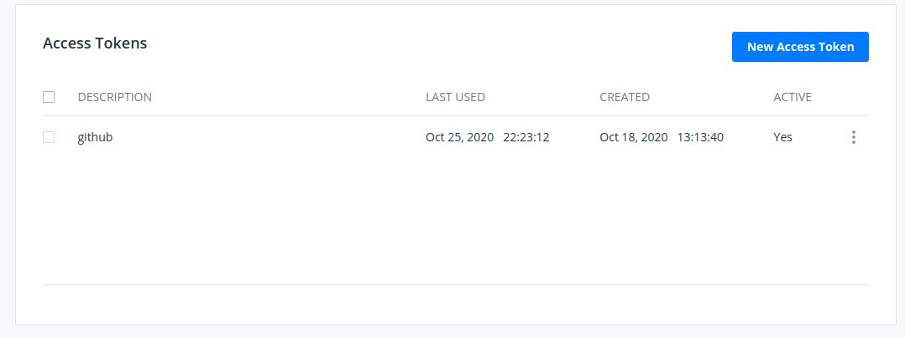
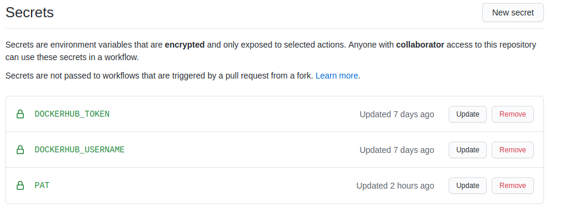

# Integración continua

## Integración continua con travis

Para utilizar `travis` en integración continua se han seguido los siguientes pasos:

- He dado de alta el repositorio en la web de travis.
- Se ha creado un archivo [.travis.yml](/.travis.yml) con la configuración 
  que quiero que se ejecute.
- Las ejecuciones de `travis` se pueden consultar en [la web de travis](https://travis-ci.com/github/yabirgb/bukhgalter/builds/).

### Descipción del archivo `.travis.yml`

    # Elegimos rust como lenguaje. Esto nos probee con utilidades como 
    # cargo, rustc para compilar etc.
    language: rust

    # le indicamos las versiones con las que queremos trabajar. Hacemos uso
    # de la ejecución múltiple de travis
    rust:
      # marcamos la ultima version disponible, en general es la que tiene
      # la gente que programa con rust
      - stable
      # Marcamos la version beta para conocer posibles problemas en versiones
      # futuras
      - beta
      # Marcamos la version 1.31 porque es la primera version en la que se incluye
      # la especificación 2018. Con anterioridad a esta version no nos interesa probar
      # - 1.31.0
      # Tras haber probado esta es la versión minima que ejecuta los tests
      - 1.40.0

    cache: cargo

    # Finalmente le indicamos que tiene que ejecutar el contenedor de igual
    # forma de la que se ejecutan en los tests de la asignatura
    scripts:
      - cargo check
      - cargo build
      - cargo test

    # No tenemos ninguna actividad que hacer post-ejecución de los tests
    # así que no incluimos tareas adicionales

En este archivo hemos elegido `Rust` como lenguaje y hemos especificado varias
versiones de rust para ejecutar los tests. Estas han sido:

- La version `stable` para comprobar que en la versión actual del lenguaje el
  programa funciona de manera correcta
- La versión `beta` para comprobar si cambios que van a ser implementados en el 
  lenguaje pueden afectar a la estabilidad del servicio.
- La versión más antigua en la que he conseguido que funcione el programa ha
  sido la `1.40.0` ya que hay un problema en versiones anteriores con las
  dependencias. La primera versión que he probado es la `1.31.0` que tiene la
  especificación de 2018 y que fue uno de los grandes saltos de Rust, pero se
  producían errores con `cargo` al instalar las dependencias.

También hago uso de la cache de travis para mejorar la velocidad de ejecución de
los tests. Esta técnica por defecto guarda el directorio en el `$HOME` de cargo
por lo que evitamos descargar siempre todas las dependencias del proyecto y de
cargo. Además se guarda el `target` del proyecto por lo que hacemos uso de las
`builds` incrementales de `rust` y la ejecución de los tests es más rápida.

Respecto a la ejecución en travis en primer lugar hacemos un `check` de las
dependencias y de nuestro proyecto por lo que encontramos posibles errores 
de sintaxis y problemas de incompatibilidades. Seguidamente hacemos una 
construcción del mismo y por último ejecutamos los tests.

### Versiones previas del archivo

Con anterioridad se creo una versión que ejecutaba el contenedor de docker
creado en el hito anterior. Esta versión se ha descartado para hacer uso de la
funcionalidad de `matrix execution` que en travis funciona de manera rápida. **La
ejecución del contenedor de docker** se ha realizado en `circleci`, documentado
más adelante.

    El archivo de travis incluyo comentarios de por qué se realza cada paso y 
    la justificación

    # Utilizo ruby como lenguaje base ya que no necesito ninguno en particular
    # y biene por defecto con travis
    language: ruby

    # Le indicamos que vamos a hacer uso de las herramientas de docker para 
    # que esten disponibles en la ejecución
    services:
      - docker

    # Como vamos a hacer uso del contenedor de docker generado por el proyecto
    # le indicamos que lo descargue del repositorio de docker hub antes de hacer 
    # nada
    before_install:
      - docker pull yabirgb/bukhgalter

    # Finalmente le indicamos que tiene que ejecutar el contenedor de igual
    # forma de la que se ejecutan en los tests de la asignatura
    scripts:
      - docker run -t -v `pwd`:/test yabirgb/bukhgalter:latest

    # No tenemos ninguna actividad que hacer post-ejecución de los tests
    # así que no incluimos tareas adicionales

## Generación automática de los contenedores para testing

Los contenedores para testing son generados automática cada vez que es
necesario. Para ello he usado una estrategia en [github actions](https://github.com/yabirgb/bukhgalter/blob/master/.github/workflows/testing.yml) que se ejecuta 
de manera inteligente:

- En primer lugar si estudia si se ha modificado el archivo `Dockerfile`
   correspondiente o el archivo de dependencia `Cargo.tolm`. También se mira se
   modifican los archivos de `CI` por si se hubiesen cambiando las estrategias.

- Si hay cambios en los archivos anteriores se construyen los contenedores y se
  publican tanto a `dockerhub` como a `github container repository`.

- En caso de no haber cambios se procede con el siguiente paso que es la
  ejecución de los tests utilizando el contenedor que se encuentra disponible en
  `dockerhub`.

## Cómo se ha configurado el despliegue

Para realizar el despliegue en `dockerhub` se han seguido los siguientes pasos:

1. Crear una cuenta en `dockerhub` con el mismo nombre de usuario que en github.
2. Crear un token para el acceso a la cuenta de `dockerhub`

3. Este token se ha añadido junto al nombre de usuario a los `secrets` del
   repositorio de github

4. Se ha configurado en `github actions` los datos de usuario usando el token
   creado para publicar los contenedores.

La parte del action donde se realiza la publicación del contenedor esta disponible [aquí](https://github.com/yabirgb/bukhgalter/blob/master/.github/workflows/testing.yml#L26).

También se podía haber configurado un trigger desde docker hub pero he preferido 
decantarme por esta opción por la libertad que me da para publicar en otras 
plataformas y porque puede _programar_ como quiero que se construyan los contenedores.

En el caso de los repositorios de `github` ha sido necesario crear un token de
acceso que también se ha añadido a los `secrets` del repositorio y se ha añadido
también al `actions` para los tests.

## Problemas encontrados

Durante el desarrollo del archivo para el `workflow` me he encontrado con varios
problemas:

- La documentación relacionada con la `action` oficial de docker no estaba muy
  clara y la que proveía github al respecto usaba una versión antigua. Además en
  el `marketplace` se enlazaba a una versión antigua de esta `action` y no a la última del repositorio. Finalmente me decidí a usar otra imagen del `marketplace` que también
  me permitía publicar mis contenedores
- La información del repositorio de github para contenedores también era confusa
  y hacía referencia a dos repositorios distintos, uno de los cuales parece estar 
  ya en desuso. Es por esto que no he encontrado documentación consistente en la página de github y subo mi imagen usando ordenes de docker, en lugar de usar algun action oficial. 
- También tuve problemas con las condiciones para construir los contenedores o
  no construirlos en función de los archivos cambiados. Finalmente me decanté
  por buscar en el `marketplace` un `action` que me permitía hacer lo que
  buscaba.
- Además se ha encontrado un problema con la ejecución de los tests en el
  contenedor usando un usuario distinto al de root. Este problema se ha 
  discutido en [contenerizacion](contenerizacion.md).

## Fuentes

- [Travis y github](https://medium.com/mobileforgood/patterns-for-continuous-integration-with-docker-on-travis-ci-71857fff14c5)
- [https://github.com/marketplace/actions/docker-login#github-container-registry](https://github.com/marketplace/actions/docker-login#github-container-registry)
- [https://github.com/marketplace/actions/publish-docker](https://github.com/marketplace/actions/publish-docker)
- [https://github.com/dorny/paths-filter](https://github.com/dorny/paths-filter)
- [https://docs.github.com/en/free-pro-team@latest/packages/getting-started-with-github-container-registry/migrating-to-github-container-registry-for-docker-images](https://docs.github.com/en/free-pro-team@latest/packages/getting-started-with-github-container-registry/migrating-to-github-container-registry-for-docker-images)
