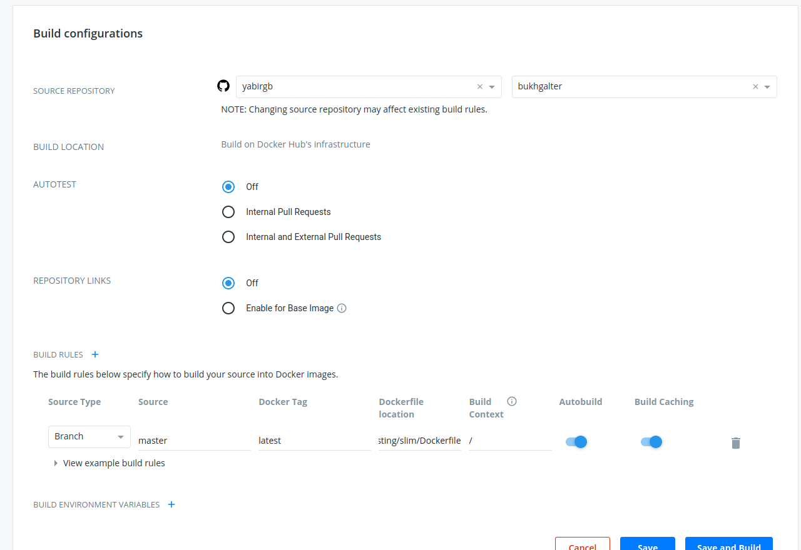
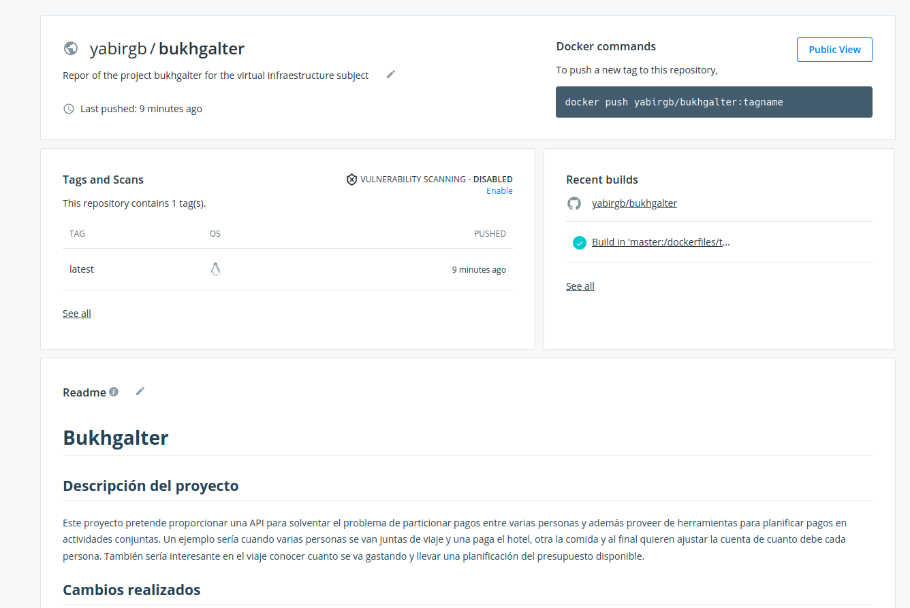

# Despliegue del contenedor en dockerhub

Inicialmente como se cuenta en la documentación sobre el [CI](CI.md) realizaba
la construcción del contenedor en un `action` de github pero tras un comentario
en el canal de Telegram he pasado a realizarlo desde `dockerhub`.

## Conectar DockerHub y Github

Lo primero que he hecho ha sido era identificarme con mi cuenta en `dockerhub`
que ya tenía pues había subido contenedores con anterioridad.

Después de eso he creado un repositorio con el mismo nombre que mi proyecto
y lo he conectado con mi cuenta de github en el apartado de builds

Tras conectar las dos cuentas el siguiente paso es elegir el repositorio que 
queremos seguir para realizar la construcción del contenedor.

Aquí la precaución que he tenido es la de enlazar correctamente el archivo de
docker que quiero utilizar. El resto de opciones aparecen bien configuradas para
escuchar a la rama master en cada push.

Una vez finalizado este paso ejecutamos save and build. Esto ejecuta la 
construcción del contenedor y tras esperar unos minutos nuestro repistorio
muestra correctamente el README y que la build ha acabado con éxito.

