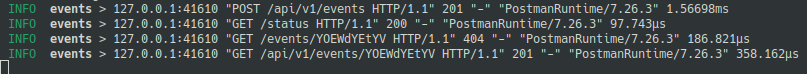

# Logging de información

Para tener conocimiento del funcionamiento de la API y detectar posibles errores
he añadido un sistema de logging. Para ello me he valido de la biblioteca de
logging de rust `log`. 

Después he usado un `middleware` para mi api (`warp::log`) que me permite
obtener [información de cada petición](https://docs.rs/warp/0.1.0/src/warp/filters/log.rs.html#32-53). 

En los logs veo información como el origen de la petición, la url que se
solicitó, el código de que se ha devuelto en la petición y el tiempo que se ha
tardado en procesar.

Para conectar con un sistema de `logging` he usado el crate `syslog`. Para ello he configurado un logger tcp 

    let formatter = Formatter3164 {
        facility: Facility::LOG_SYSLOG,
        hostname: None,
        process: "bukhgalter".into(),
        pid: 0,
    };

    let log_host = get_env_var("log_host".to_string()).await.unwrap();
    let log_port = get_env_var("log_port".to_string()).await.unwrap();

    let logger = syslog::tcp(formatter, format!("{}:{}", log_host, log_port)).expect("could not connect to syslog");
    log::set_boxed_logger(Box::new(BasicLogger::new(logger)))
    .map(|()| log::set_max_level(LevelFilter::Info));    

En el código anterior lo que hacemos es obtener del entorno la información para
loggear a un servidor tcp. Después creamos el logger conectándonos a dicho
servidor e inicializamos el logger creando en memoria una instancia y
estableciendo el nivel de los logs.

Lo que he hecho es usar esta configuración cuando detecta que la variable de
entorno `mode` tiene el valor `prod`.

y he utilizado `papertrail` para recibir las peticiones.

    Nota: He tenido problemas para conectarme a papertrail utilizando esta opción. He nota que pasando por un archivo intermedio y usando la aplicación syslog2 de papertrail no hay problema, pero no he podido 
    hacerlo directamente desde mi aplicación. He abierto un issue para poder descubrir que puede estar pasando ya que la documentación para estas librerías es escasa.