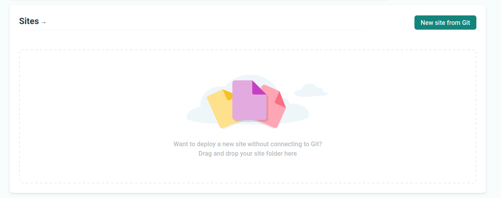
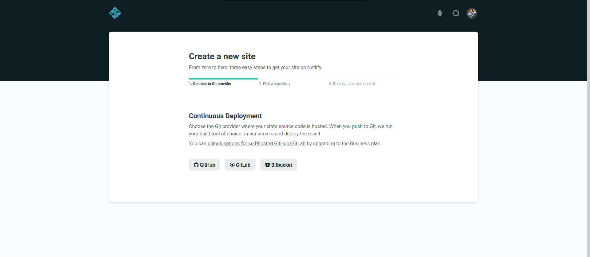
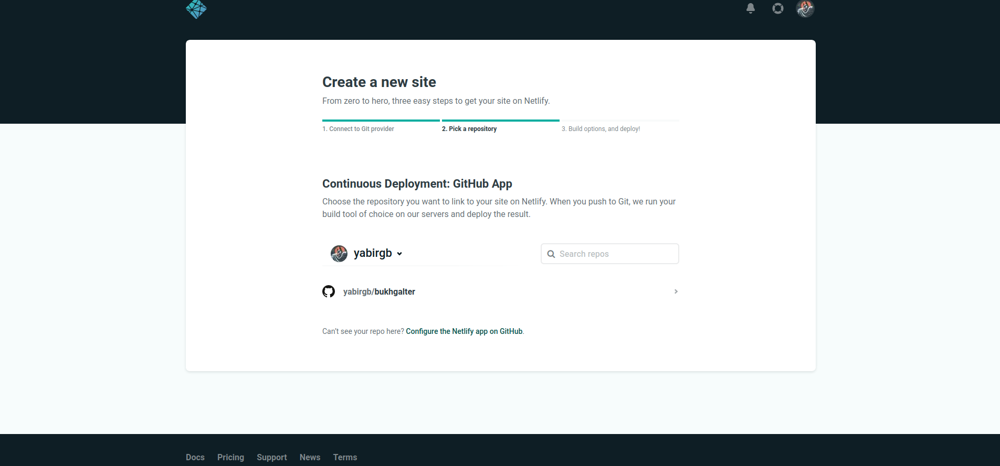
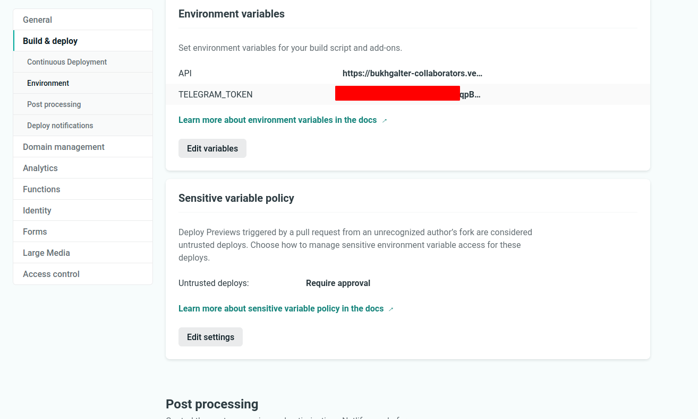
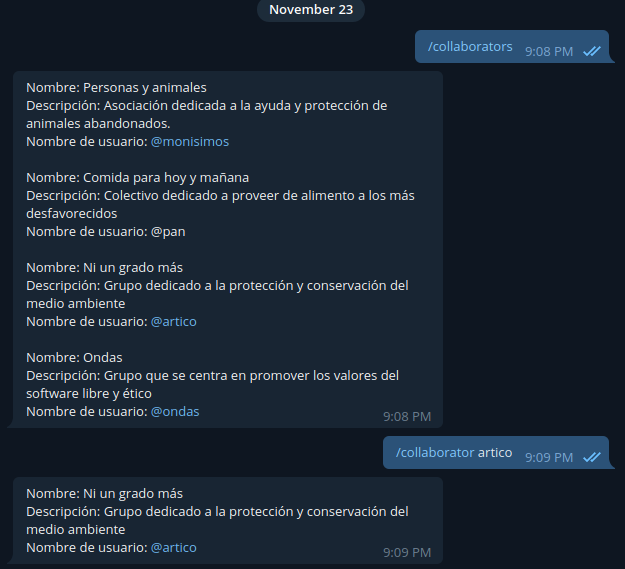

# Desplegado en netlify

Tras hacer loguin en la página de netlify nos aparece la siguiente ventana. Aquí hacemos click en `New site from Git`

Llegamos a una página donde nos guía para enlazar un proyecto

Seleccionamos el proyecto que queremos enlazar

A continuacón, dado que la configuración de mi proyecto es un poco especial he
creado un archivo [netlify.toml](https://github.com/yabirgb/bukhgalter/blob/master/netlify.toml)

    [build]
    base = "ui/"

En este documento le indicamos que queremos desplegar el contenido que haya en
la carpeta `ui`. En esta carpeta he colocado otro archivo con

    [build]
        command = "npm run build && npm run buildLambda"
        functions = "functions"
        publish = "public/"

que le indica la orden que tiene que usar para compilar el sitio web y donde se
encuentran las funciones serverless.

También he declaro variables de entorno desde la interfaz que son usadas por el bot de telegram

Con estas indicaciones netlify ya sabe como debe construir nuestro proyecto y
las builds se activan de manera automática cada vez que se hace commit. Como
último paso le he asignado un dominio desde la interfaz de netlify. El proyecto
está disponible en [bukhgalter.netlify.app/](bukhgalter.netlify.app/). Se pueden
consultar las estadísticas de la construcción en
[https://app.netlify.com/sites/bukhgalter/deploys/5fbaa4e84c0b4b61d33ffdc2](https://app.netlify.com/sites/bukhgalter/deploys/5fbaa4e84c0b4b61d33ffdc2)

El bot de telegram funciona de manera correcta

El sitio queda finalmente así:

