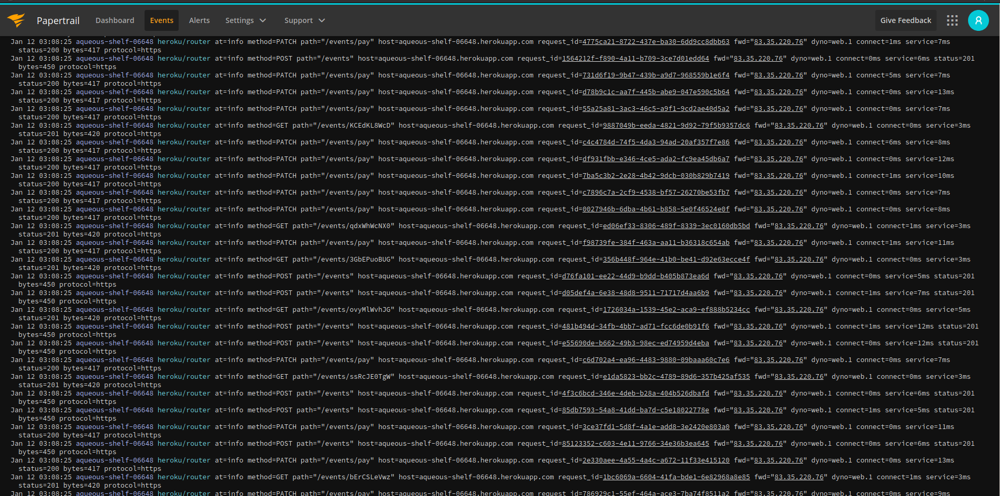

# Despliegue en PAAS

## Servicio elegido

Para desplegar mi aplicación me he decantado por usar [Heroku](https://heroku.com). Los motivos para esta
elección han sido los siguientes:

- Tenía que poder desplegar una aplicación en Rust o ofrecer despliegue de contenedores.
- Debe permitir especificar la infraestructura y requisitos del proyecto.
- Buena integración con los servicios de integración continua.
- Debe tener un plan gratuito.

### Alternativas consideradas

#### Dokku

- Es una aplicación para self-hosting y por lo tanto no tiene plan gratuito.
- Una de las ventajas que tiene es que podemos usar nuestro propio servidor.

#### Back4App

- Es una plataforma más orientada a bases de datos.
- El plan gratuito se encuentra muy limitado.

#### Heroku

- Con el pack student de github educations podemos obtener un mejor plan.
- Herramienta de CLI muy completa.
- Existen buildpacks para rust.
- Buen soporte para docker.

De entre las anteriores la que cumple todos los requisitos y más ventajas me aportaba era Heroku. El sistema de addons es muy potente y facilita la integración con otros servicios.

## Métodos para el despliegue

He probado tres estrategias de despliegue distinta

### Despliegue mediante Procfile

He probado a usar el buildpack de rust para hacer deploy del proyecto usando un archivo [Procfile](https://github.com/yabirgb/bukhgalter/blob/4e9f301c1c37ffe2dd9e83afc3b1cb05c1b4d652/Procfile). El problema con 
este método de despligue es que no puedo especificar de manera sencilla otros aspectos del despliegue como
el uso de addons.

### Despliegue mediante webhook

La primera técnica de despliegue que he probado ha sido la de especificar en el archivo [heroku.yml](heroku.yml) (archivo donde puedo especificar las características del despliegue) y conectar 
heroku con el repositorio de github desde la configuración de la app de heroku.

Este método de despligue a tenido el contratiempo de que el contenedor se construye utilizando 
los dynos de mi cuenta, y debido a las limitaciones de los mismos, la construcción del proyecto 
es extremadamente lenta. Un despligue ha tardado 40 minutos en ejecutarse.

### Despliegue utilizando CD

Mi tercera estrategia y con la que me he quedado ha sido utilizar los workflows de github para realizar 
el despligue. He comprobado que al utilizar la utilidad de CLI de heroku puedes compilar el cotenedor
que quieres utilizar y subirlo a los repositorios de heroku de manera que se puede utilizar ese contenedor
para poner a funcionar la aplicación.

De esta manera los contenedores no se compilan en el dyno de heroku, sino en la máquina local. Mi experiencia es que los servidores de github son rápidos para compilar y, por este motivo, me he 
decantado por utilizarlos para hacer el despliegue. 

En primer lugar [creamos la aplicación](https://devcenter.heroku.com/changelog-items/1441) a partir del `manifest` (el archivo `heroku.yml`) para que la aplicación se genere con la estructura y addons que necesitamos.

    heroku create --manifest

En el archivo [de configuración para los workflows de github](https://github.com/yabirgb/bukhgalter/blob/master/.github/workflows/testing.yml) he especificado que una vez los tests hayan pasado, se proceda
a hacer deploy de la aplicación utilizando la utilidad de CLI de heroku. Esto sucede en la rama master, que
será la que utilice como rama para hacer los deploys. Un ejemplo de deploy ha sido [este](https://github.com/yabirgb/bukhgalter/runs/1674792424?check_suite_focus=true) donde ha tardado 17 minutos en completar el compilado de la aplicación.

Los pasos que se siguen son los siguientes:

- Realizar los tests.
- Si los tests pasan contruir el contenedor de docker que se va a lanzar.
- Publicar en el registro de heroku el contenedor construido.
- Poner en funcionamiento el contenedor publicado.

## Addons utilizados

Para el deploy de mi aplicación he considerado dos addons distintos:

- `Heroku Postgres`: Para la persistencia de datos me he decantado por utilizar postgres y con este addon puedo levantar una base de datos de manera sencilla. Mi intención era usar una base de datos nosql pero quería que pudiese confiugurarla desde heroku y mongo había quitado su addon. Otras opciones nosql no he
visto que tengan bueno soporte para Rust.
- `Papertrail`: Con el addon de papertrail puedo obtener los de todo lo que pasa en el dyno desde la interfaz de papertrail. Desde información del deploy hasta los logs que he añadido al servidor. De esta manera cuando hay problemas en la API es fácil detectarlos en cualquier
lugar posible donde se puedan producir.

## Test de rendimiento 

He decidido no hacer tests de rendimiento realmente que pongan al límite el servidor por la información que he encontrado disponible en 
[la documentación de heroku al respecto](https://devcenter.heroku.com/articles/load-testing-guidelines)
donde se especifica que solo tiers más altos tienen permiso para hacer tests de rendimiento. 

He optado por hacer tests pequeños en el servidor y más interesantes en local.

Sobre mi aplicación, utiliza tokio para hacer la concurrencia. Por este motivo no he considerado necesario
la utilización de un software que controle la ejecución del servidor. La aplicación ejecuta el servidor
de `warp` y este se replica en cada core disponible. Por cada petición que llega un thread es creado que 
se encarga de manejar la petición. He tenido problemas con al versión de `tokio` que puedo usar por ser
compatible con `warp`y la que me gustaría tener por libertad de configurar parámetros. La versión más moderna me permite controlar parámetros como la cantidad de hilos que se crean y cómo se manejan, pero 
la versión compatible con warp no me da tanta libertad. He intentado hacer la configuración manual 
de tokio pero me daba problemas al recibir peticiones y he optado por no modificar estos parámetros.

En los tests he probado un workflow en el que se ejecutan las tres actividades más comunes en la 
api que he desarrollado de crear, actualizar y leer información.

Los tests del servidor han dado los siguientes resultados con la configuración siguiente:

- 20 threads
- 0.5 seconds de tiempo para spawnear
- 6 loops

|Label         |# Samples|Average|Median|90% Line|95% Line|99% Line|Min|Max  |Error %|Throughput|Received KB/sec|Sent KB/sec|
|--------------|---------|-------|------|--------|--------|--------|---|-----|-------|----------|---------------|-----------|
|Create action |120      |196    |127   |547     |570     |572     |112|578  |0.000% |47.39336  |23.42          |36.19      |
|Retrive action|120      |120    |120   |128     |134     |146     |105|148  |0.000% |55.89194  |25.98          |8.79       |
|Pay           |120      |128    |125   |146     |149     |157     |111|157  |0.000% |55.94406  |25.84          |16.06      |
|TOTAL         |360      |148    |123   |148     |518     |570     |105|578  |0.000% |129.58963 |61.38          |52.18      |

Como se puede apreciar la mitad de las peticiones se han resuelto en menos de 123 ms y como era de esperar
la acción de crear eventos en la base de datos son las que se ejecutan con mayor lentitud aunque, la que más ha tardado ha tomado 578ms, un tiempo bastante respetable para las limitaciones del dyno.

Las pruebas de rendimiento en local las he realizado en un ordenador con las siguientes características

- CPU: Intel i7-10710U (12) @ 4.700GHz
- Memoria: 15843MiB
- 4000 threads
- 0.5 seconds de tiempo para spawnear
- 6 loops

|Label         |# Samples|Average|Median|90% Line|95% Line|99% Line|Min|Max  |Error %|Throughput|Received KB/sec|Sent KB/sec|
|--------------|---------|-------|------|--------|--------|--------|---|-----|-------|----------|---------------|-----------|
|Create action |24000    |1345   |107   |4908    |9262    |17143   |2  |19158|0.000% |1162.39647|510.82         |866.12     |
|Retrive action|24000    |100    |66    |236     |300     |468     |0  |670  |0.000% |1162.62171|476.86         |161.22     |
|Pay           |24000    |111    |82    |255     |312     |455     |1  |669  |0.000% |1162.79070|473.52         |312.27     |
|TOTAL         |72000    |519    |83    |305     |547     |15603   |0  |19158|0.000% |3486.85166|1460.80        |1339.35    |

Este test es bastante grande y pocas aplicaciones realmente tienen esta carga pero la mitad de las peticiones se han resuelto en como mucho 107 ms. El troughput total es de 3486 req/s lo cual es 
una cantidad bastante bueno aunque hay que tener en cuenta que mi maquina tiene la posibilidad de 
tratar varios hilos de manera simultanea con cierta facilidad. 

Es importante apreciar que en ambos casos la tasa de error es del 0%. Estos tests sirven para ejemplificar
que el rendimiento del servidor es bueno y la estabilidad y rendimiento del dyno de heroku es bastante decente.

## Diseño de la API

Respecto al diseño de la api he cubierto todas las HU con los recursos especificados en [la documentaicón](URLS.md). He modificado también como se recomendo las urls y he eliminado el prefijo `/api/v1` de las urls.

## Problemas encontrados

- Uno de los principales problemas que he tenido han sido los altos tiempos de compilación, que no permiten
un despliegue rápido del servidor. Esto es debido a que se compila utilizando el flag `--release` del compilador que realiza optimizaciones en todas las dependencias además de realizar las comprobaciones sobre
los tipos y la memoria que hace Rust.

- El addon oficial de mongo ha sido eliminado del marketplace de heroku.

## Bibliografía

- [Archivo de configuración de heroku](https://devcenter.heroku.com/articles/build-docker-images-heroku-yml)
- [Despliegue utilizando contenedores](https://devcenter.heroku.com/articles/container-registry-and-runtime)
- [Crear aplicaciones a partir de un manifiesto](https://devcenter.heroku.com/changelog-items/1441)