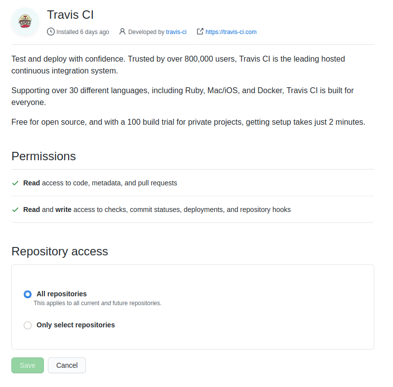
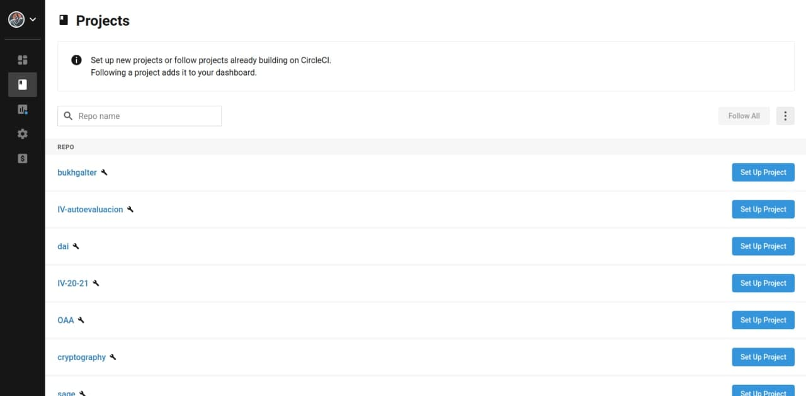
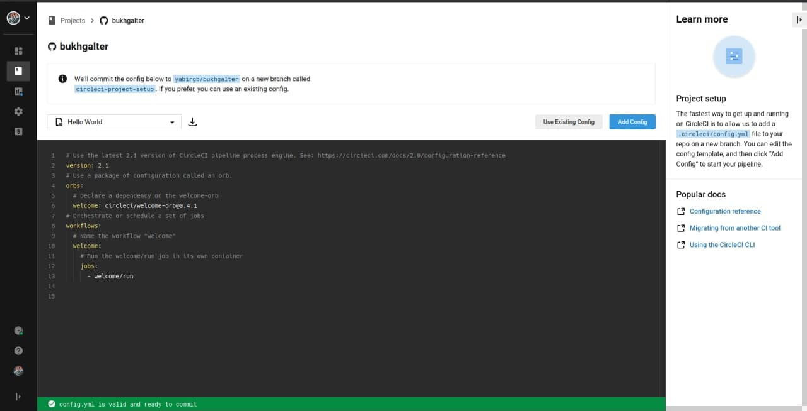

# Registro en los sistemas de CI

## Travis

En el caso de travis los pasos generales son:

- Acceder a travis con nuestra cuenta de github
- Autorizar a travis para leer nuestros repositorios

- Con los permisos por defecto travis lee los repositorios públicos
    y busca referencias al archivo `.travis.yml`.

En mi caso ya tenía la cuenta asociada y no he tenido que hacer nada
especial para 

## Circle CI

En el caso de circle-ci las dos opciones disponibles son registrarse usando github o bitbucket. En mi caso lo he hecho con github. Tras 
loguearse aparece nuestra lista de repositorios

En esta ventana en nuestro proyecto seleccionamos `Set Up Project`. Tras hacer click nos aparece la siguiente ventana. En la siguiente ventana se
nos da la opción de instalar una configuración por defecto o de usar
una configuración ya existente.

Finalmente si hacemos push al proyecto se dispara la build del mismo.