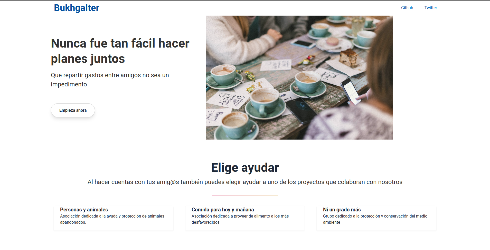

# Serverless

## Objetivo

Se han creado dos historias de usuario
([HU6](https://github.com/yabirgb/bukhgalter/issues/56)
[HU7](https://github.com/yabirgb/bukhgalter/issues/57)). Para cubrir a nivel de
backend las necesidades de _HU7_ se ha decidido crear un servicio serverless 
para listar las organizaciones que colaboran con el proyecto.

## Elección de la plataforma

Al estar mi código desarrollado en _Rust_ he encontrado dificultades para
encontrar plataformas con buen soporte. Me he decantado por **Vercel** que,
aunque no lo soporta de manera oficial, sí cuenta con soporte para Rust hecho
por la comunidad. He descartado plataformas como _azure_ por no contar con un
soporte bien documentado para _Rust_ o _aws_ por requerir una configuración 
que no es la convencional y exigir el uso de herramientas muy concretas para 
_Rust_.

## Código desarrollado

He desarrollado una función que lee una lista en formato string pero con la
estructura de un documento `json`, y la devuelve marcando el tipo de contenido
como `application/json`.

    fn handler(_: Request) -> Result<impl IntoResponse, NowError> {
        let response = Response::builder()
            .status(StatusCode::OK)
            .header("Content-Type", "application/json")
            .header("Access-Control-Allow-Origin", "*")
            .body(collaborators.to_string())
            .expect("Internal Server Error");

            Ok(response)
    }

El código desarrollado con la configuración se encuentra disponible en [bukhgalter-collaborators](https://github.com/yabirgb/bukhgalter-collaborators).

En esta pieza de código lo que estamos haciendo es crear una respuesta http en
la que especificamos el código de la misma, que es un documento `json`, que
cualquiera puede hacer una petición al endpoint (he decidido hacerlo así para
permitir que otra gente pueda acceder ya que no es contenido crítico).
Finalmente le pasamos al cuerpo la cadena json y si algo falla devolvemos un
código de error.

Como precaución he seguido el consejo proporcionado en clase y, en lugar de leer
un archivo cada vez que se hace una petición, he leido una variable que se lee
en tiempo de compilación y está un archivo separado del resto del código. De
esta manera se puede generar de manera rápida y automática sin necesidad y no
se pierde tiempo en accesos al posible archivo. 

Además se ha reducido el tamaño de la respuesta lo máximo posible para consumir
únicamente lo necesario en ancho de banda y que la respuesta sea lo más rápida
posible.

Se puede hacer una petición en
[http://bukhgalter-collaborators.vercel.app/](http://bukhgalter-collaborators.vercel.app/).
El repositorio ha sido [enlazado con vercel](vercel.md)

## Desplegado de la UI

Para completar el objetivo con la HU mi intención era desplegar una función
serverless que me devolviera un archivo html que contuviese un SPA pero he sido
incapaz de lograrlo de manera correcta por problemas en como se devuelven los
archivos estáticos. Como alternativa he desplegado un bot de Telegram,
[@bukhgalterbot](http://t.me/bukhgalterbot) . 

Respecto al SPA que había creado lo realicé porque en local si me funcionaba
pero en netlify no por como funciona el almacenamiento de archivos. Dado que
esta web también interactua con la app he decido dejarla disponible
[https://bukhgalter.netlify.app/](https://bukhgalter.netlify.app/).

### Criterios que he seguido

En primer lugar me he decantado por netlify porque creo que cuenta con muchas herramientas
interesantes para desplegar páginas como la que quería crear. Además la interfaz es muy completa
y me permite ver claramente lo que está pasando con el sitio web. El rendimiento que he experimentado
es muy bueno y no he notado que me haga falta nada que no tenga con netlify.

Respecto al lenguaje utilizado me he decantado por usar `node` por los siguientes motivos:

- Netlify le da soporte a node
- node es una herramienta popular para hacer bots de Telegram.
- He notado que no hay ninguna ventaja considerables en términos de rendimiento
  por usar un lenguaje compilado frente a uno que no lo sea.
- Tengo más dominio sobre node que otras alternativas consideradas como go.

El desplegado lo he documentado en un archivo sobre [netlify](netlify.md)

He obtado usar este repositorio como un `monorepo` con la excepción de la
función serverless de `rust`. La interfaz se encuentra en la carpeta [ui](https://github.com/yabirgb/bukhgalter/tree/master/ui).

## Diseño del bot

Para el desarrollo del bot me he valido de la librería que me ha salido en
github como más popular, [Telegraf](https://telegraf.js.org/#/). He elegido esta
porque tenía lo que me hacía falta para poder crear el bot y en el ejemplo he
visto que era fácil de usar. También he usado el ejemplo del propio [netlify](https://github.com/jokarz/netlify-fauna-telegram-bot)
para desplegar bots de telegram.

En el código he declaro las variables importantes como variables de entorno

- El token de Telegram ya que es contenido crítico.
- La url de la api ya que puede cambiar y puede interesar usar otra sin cambiar el código.

La manera de programar es la estandard salvo con la excepción de cómo se ejecuta el mismo

      exports.handler = async (event, ctx, callback) => {
         await bot.handleUpdate(JSON.parse(event.body));
         return callback(null, { statusCode: 200 });
      };

De esta manera le decimos que en lugar de hacer pooling tiene que escuchar las
solicitudes que reciba desde el endpoint.

Para enlazar Telegram con el bot mediante he tenido que hacer una petición a la url 

   https://api.telegram.org/bot{your_bot_token}/setWebhook?url={your_netlify_domain_url}/api/bot

de manera que obtendo el siguiente mensaje

      {
         "ok": true,
         "result": true,
         "description": "Webhook was set"
      }

y queda enlazado el bot con telegram mediante el uso de webhooks.

El bot cuenta con dos ordenes básicas:

- `/collaborators`: Muestra la lista de colaboradores que devuelve la API desde vercel.
- `/collaborator [name]`: Si hay un colaborador con ese nombre de usuario muestra su información.

## Problemas encontrados

1. El primer problema que he encontrado es que no se puede tener la última
   versión del microframework web que se usa. La razón es que la librería `lambda`
   que sirve para generar una estructura de petición compatible con `vercel` no es
   compatible con la nueva versión del microframework web y por tanto no se puede elevar 
   la versión del mismo.

2. El segundo problema es que la librería disponible para usar `vercel` con
   _Rust_ no sigue siendo activamente desarrollada y no están disponibles todas
   las funcionalidades actuales. La principal que he echado en falta es que no
   se puede enlazar un proyecto en una subcarpeta por lo que no he podido hacer
   autodeploy de mi función serverless. Me he decantado por mover lo necesario a
   un proyecto nuevo [bukhgalter-collaborators](https://github.com/yabirgb/bukhgalter-collaborators).

3. No he encontrado la manera correcta de evitar que se publique la ui en cada
   commit que hago. Finalmente me he decantado por usar un [github actions](https://github.com/yabirgb/bukhgalter/blob/master/.github/workflows/build_netlify.yml)
   que realiza una llamada a netlify e inicializa la construcción del sitio. De esta manera solo 
   se construye cuando detecta que hay cambios en la UI. 