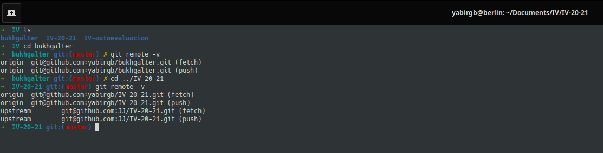
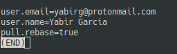

# Preparación del entorno de desarrollo

En primer lugar se han creado dos repositorios en github. Uno que contiene el
proyecto que se va a desarrollar durante el cuatrimestre y otro preparado 
para albergar los ejercicios voluntarios.

- [Bukhgalter](https://github.com/yabirgb/bukhgalter)
- [Autoevaluación](https://github.com/yabirgb/IV-autoevaluacion)

También se ha hecho un [fork](https://github.com/yabirgb/IV-20-21) del proyecto
de la asignatura y en la máquina local se le ha añadido el repositorio original 
para actualizar los cambios.

En la siguiente imagen se puede ver como los tres repositorios mencionados están
clonados y como se han añadido mediante ssh. Además en el caso del repositorio
`IV-20-21` se ha añadido la dirección del repositorio original.

Además en la siguiente imagen se puede ver como los valores para el correo
electrónico y el nombre han sido añadido a git.

Esta dirección de correo es la que figura en mi cuenta de github como asociada.