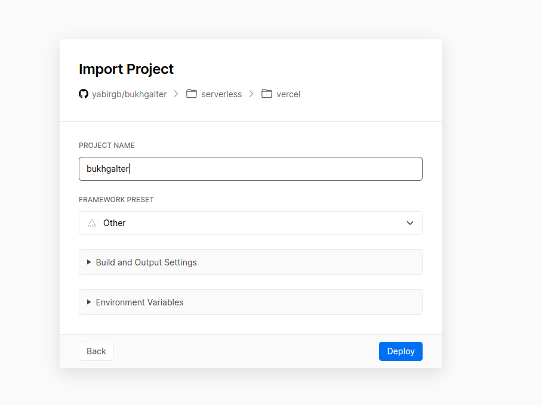
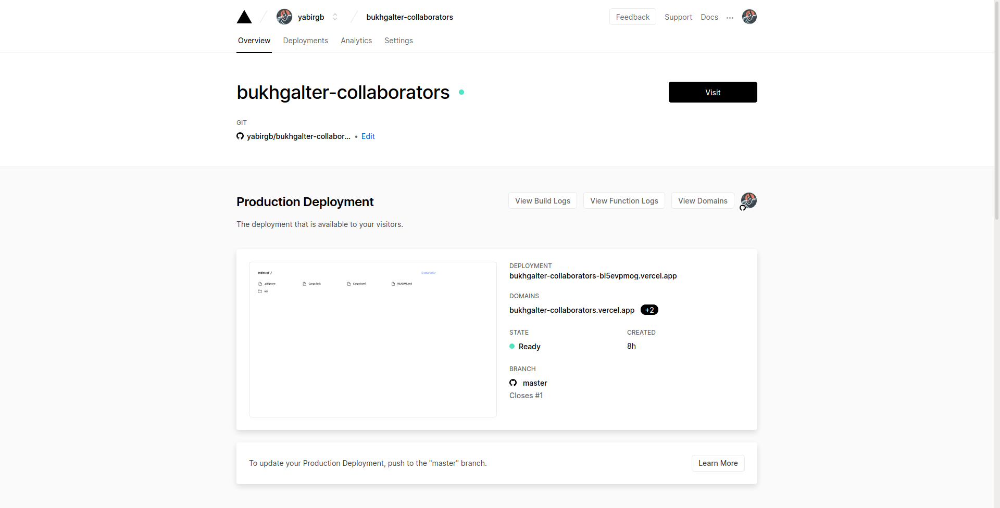

# Desplegado en vercel

En el caso de vercel me he logueado con mi cuenta de github y he enlazado el proyecto

Tras enlazar el proyecto, la interfaz que tenemos es

En el caso de vercel he tenido que crear un archivo [now.json](https://github.com/yabirgb/bukhgalter-collaborators/blob/master/now.json)

    {
        "functions": {
            "api/**/*.rs": {
                "runtime": "now-rust@2.0.0"
            }
        }
    }

que le indica que en la carpeta `api` para los archivos `.rs` tiene que usar el
runtime `now-rust@2.0.0`. Este runtime ha sido creado por la comunidad y permite
compilar rust para usarse con vercel.